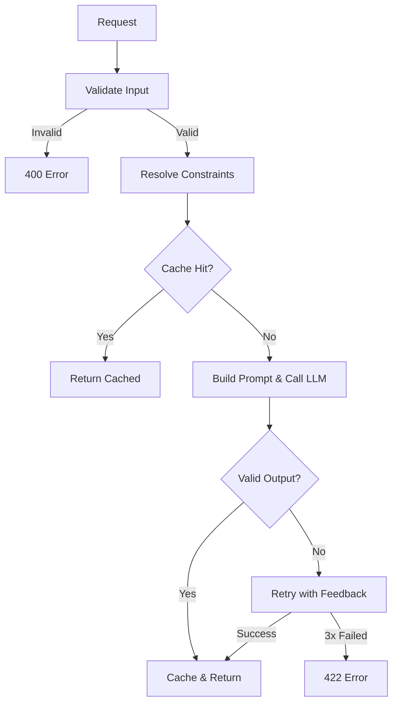

# specllm

[](https://pypi.org/project/specllm/)
[](https://pypi.org/project/specllm/)
[](LICENSE)

**Makes any LLM behave like a regular REST API.** Define the contract, specllm enforces it. The caller never knows an LLM is involved.

Every team shipping LLMs into production rebuilds the same layer: validation, retries, caching, error handling. specllm handles all of it from your API spec.


## Quick Start

```bash
pip install specllm
python -m specllm.demo   # runs locally, no API key needed
```

Or with a real LLM:

```bash
pip install specllm[anthropic]
```

```python
from specllm import SpecLLM

app = SpecLLM.from_openapi("./api.yaml")  # provider inferred from spec
app.serve(port=8080)
```

Your spec declares the model:

```yaml
info:
  x-specllm-model: claude-sonnet-4-20250514
```

That's it. No provider class, no config.

## Features

### Model Selection via Spec

```yaml
info:
  x-specllm-model: claude-sonnet-4-20250514   # default for all endpoints

paths:
  /v1/fast-route:
    post:
      x-specllm-model: claude-haiku-4          # override: cheap/fast
```

Built-in providers: Anthropic (`claude-*`) and OpenAI (`gpt-*`, `o1-*`, `o3-*`). Custom providers just implement one method:

```python
class MyProvider(LLMProvider):
    def call(self, prompt: str, system_prompt=None) -> str:
        ...  # return raw text or dict — pipeline handles JSON extraction
```

### Dynamic Response Constraints (`x-constrain-from`)

Let the caller control what the LLM can return — per request:

```yaml
intent:
  type: string
  x-constrain-from: "intents"    # enum pulled from request body field "intents"

score:
  type: integer
  x-constrain-from:
    minimum: "min_score"          # range pulled from request body
    maximum: "max_score"
```

If the LLM picks outside the caller's options, specllm retries with feedback automatically.

### Custom Validation & Prompts

```python
@app.validate("/v1/route-ticket")
def only_enterprise(body):
    if body.get("customer_tier") != "enterprise":
        return "Only enterprise tickets accepted"

@app.prompt("/v1/answer")
def grounded_prompt(body):
    return (
        f"Answer ONLY from the following context. If the answer is not in the context, say so.\n\n"
        f"Context:\n{body['context']}\n\n"
        f"Question: {body['question']}"
    )
```

### Configuration (optional overrides)

```python
app = SpecLLM.from_openapi("./api.yaml", config={
    "timeout_seconds": 30,
    "fallback_provider": backup_provider,
    "cost_limit_daily": 50.0,
    "cache_ttl": 3600,
})
```

### Observability

Every response includes headers: `X-SpecLLM-Request-Id`, `X-SpecLLM-Latency-Ms`, `X-SpecLLM-Tokens-Used`, `X-SpecLLM-Retries`, `X-SpecLLM-Cache-Hit`.

### Testing (no LLM credentials needed)

```python
from specllm.testing.record_replay import RecordReplayProvider

# Record locally, replay in CI:
provider = RecordReplayProvider(provider=real_provider, cassette="tests/tape.json")
```

## How It Works



## Error Handling

| Scenario | HTTP | Code |
|----------|------|------|
| Bad input | 400 | `INPUT_VALIDATION_FAILED` |
| Output failed after retries | 422 | `OUTPUT_SCHEMA_VIOLATION` |
| Provider down/timeout | 503/504 | `PROVIDER_UNAVAILABLE` / `PROVIDER_TIMEOUT` |
| Cost limit hit | 503 | `COST_LIMIT_REACHED` |

All errors return structured JSON with `code`, `status`, `message`, `request_id`, `timestamp`.

## License

Apache License 2.0
